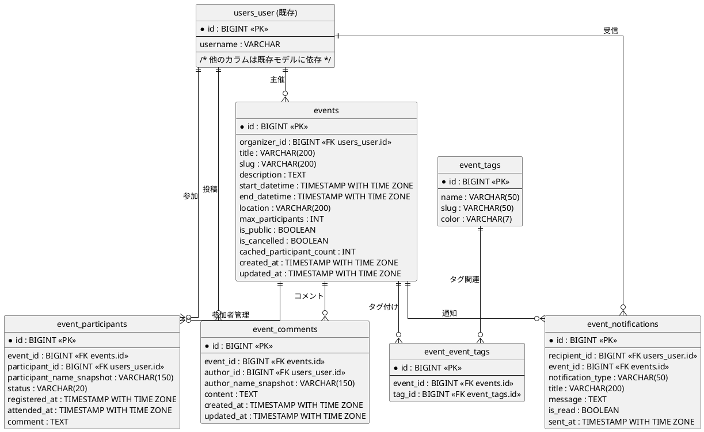
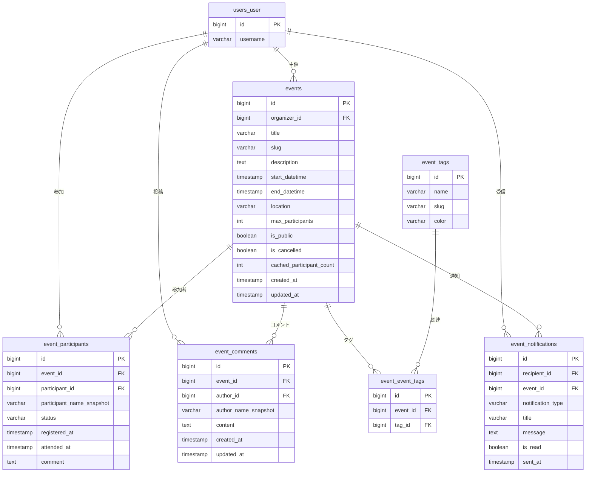

# Event App - ER 図

作成日: 2025-01-01

以下は Event 管理機能に関するER図（論理設計）と補足説明です。PlantUML を使って描画できます。

---

## PlantUML（レンダリング可能）

---

## Mermaid（ER 図）

---

## 重要な振る舞い（補足）

### 参加者管理
- EventParticipant.participant はユーザ削除時に NULL にされ、表示用の `participant_name_snapshot` は '削除されたユーザ' に置換されます（DB 及び表示の匿名化処理）。
- Event と User は EventParticipant を通じて多対多関係になります。
- status フィールドで参加状態を管理（registered → attended/absent）。

### イベント制約
- start_datetime < end_datetime の制約により、不正な日時設定を防止します。
- max_participants=0 は無制限を意味し、参加登録時にチェックされます。
- cached_participant_count はパフォーマンス改善のため、参加者数の変更時に更新されます。

### タグとコメント
- Event と EventTag は多対多（M:N）で `event_event_tags` 中間テーブルを持ちます。
- EventComment により参加者同士の情報共有やQ&Aが可能です。

### 通知システム
- event_notifications テーブルで通知履歴を管理し、既読/未読状態を追跡します。
- notification_type により通知の種類を分類（作成・更新・参加・リマインダー等）。

### プライバシーとアクセス制御
- is_public フラグにより公開・非公開を制御します。
- ユーザの詳細（メール等）は API レイヤで出力制御を行い、ゲストには公開可能なフィールドのみ返却します。

---

ファイルを生成しました。PlantUML をレンダリングしますか、あるいは mermaid / PNG 形式で出力しますか？

---