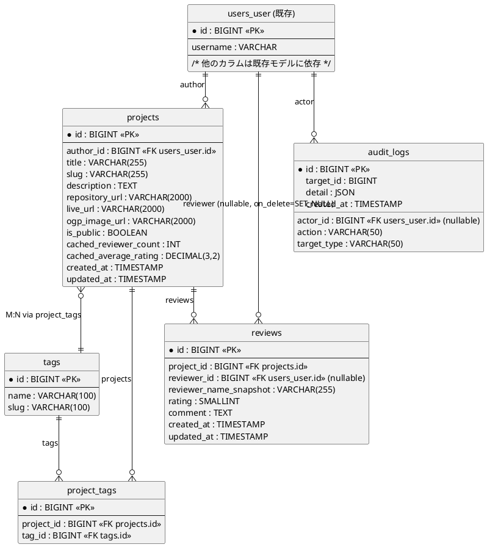

# Review App - ER 図

作成日: 2025-08-19

以下は Review 機能に関するER図（論理設計）と補足説明です。PlantUML を使って描画できます。

---

## PlantUML（レンダリング可能）



---

## 重要な振る舞い（補足）
- Review.reviewer はユーザ削除時に NULL にされ、表示用の `reviewer_name_snapshot` は '削除されたユーザ' に置換されます（DB 及び表示の匿名化処理）。
- Project と Tag は多対多（M:N）で `project_tags` 中間テーブルを持ちます。
- Project はレビューの平均評価・レビュー数を `cached_average_rating` / `cached_reviewer_count` に保持してパフォーマンス改善します。
- ユーザの詳細（メール等）は API レイヤで出力制御を行い、ゲストには公開可能なフィールドのみ返却します。

---

ファイルを生成しました。PlantUML をレンダリングしますか、あるいは mermaid / PNG 形式で出力しますか？

---

## Mermaid（ER 図）
以下は同じERをMermaidのerDiagram形式で表現したものです。

```mermaid
erDiagram
    USERS {
        BIGINT id PK
        VARCHAR username
    }

    PROJECTS {
        BIGINT id PK
        BIGINT author_id FK
        VARCHAR title
        VARCHAR slug
        TEXT description
        VARCHAR repository_url
        VARCHAR live_url
        VARCHAR ogp_image_url
        BOOLEAN is_public
        INT cached_reviewer_count
        DECIMAL cached_average_rating
        TIMESTAMP created_at
        TIMESTAMP updated_at
    }

    TAGS {
        BIGINT id PK
        VARCHAR name
        VARCHAR slug
    }

    PROJECT_TAGS {
        BIGINT id PK
        BIGINT project_id FK
        BIGINT tag_id FK
    }

    REVIEWS {
        BIGINT id PK
        BIGINT project_id FK
        BIGINT reviewer_id FK NULLABLE
        VARCHAR reviewer_name_snapshot
        SMALLINT rating
        TEXT comment
        TIMESTAMP created_at
        TIMESTAMP updated_at
    }

    AUDIT_LOGS {
        BIGINT id PK
        BIGINT actor_id FK NULLABLE
        VARCHAR action
        VARCHAR target_type
        BIGINT target_id
        JSON detail
        TIMESTAMP created_at
    }

    %% リレーション定義
    USERS ||--o{ PROJECTS : "author"
    PROJECTS ||--o{ REVIEWS : "reviews"
    USERS ||--o{ REVIEWS : "reviewer (nullable)"
    PROJECTS }o--|| TAGS : "M:N via project_tags"
    PROJECTS ||--o{ PROJECT_TAGS : "projects"
    TAGS ||--o{ PROJECT_TAGS : "tags"
    USERS ||--o{ AUDIT_LOGS : "actor"
```

---
